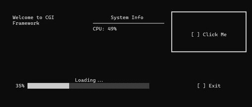
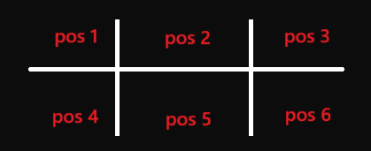
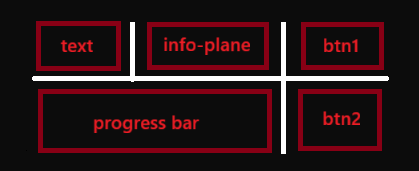

# CGI Applications library
### console graphical interface applications library
### Contributing: [CONTRIBUTING.md](CONTRIBUTING.md)

<br>

## What is a library?
#### This library is a tool for creating graphical interfaces like the one below, consisting of a grid of positions occupied by widgets.



- pic `1` `ui view demo` (main.py script - example)

### Widgets on this example:

#### `[] Click me` and `[] Exit` - Button's widgets (1x1 grid cells),
#### Label `Welcome to CGI...` - Text widget (1x1),
#### Widget of title `System info` and content `CPU: ...` - Info-panel widget (1x1),
#### And last widget - progress bar (2x1 grid cells) widget

<br>

Widgets can be of different sizes, e.g. progress bar - 2x1 cells, buttons - 1x1 cells.

In pic `1` the widget-button `[] Click me` is surrounded by a frame - the cursor is on this:

The cursor can be moved using the arrow keys and enter to press the buttons.

<br>

### Description of the cells grid's work

- pic `2` `grid cells division`

#### In the example (on pic `1`) and by default the grid map size is 3x2 (3 columns and 2 rows, pic `2`):

```python
class WidgetsGridDefaultStyle(Style):
    grid_size = (2, 3) # Grid size here
    
    one_cell_size = (6, 24)
    cells_distance = 3
    
    top_padding = 2
    left_padding = 4
```

The cells also have a specified size (`one_cell_size`) and distance between them (`cells_distance`)

Thus, we can depict the layout of widgets in the `main.py` example (pic `1`) by cells like this:


- pic `3` `grid cells division: widget layout in example)`

<br>

## Installation

```bash
pip install -r requirements.txt
```

<br>

## Quick Start

```python
from cgi import Application, ButtonWidget, TextWidget

# Create application
app = Application()

# Add widgets
text = TextWidget("Hello, World!")
app.add_widget(text, position=(0, 0))

button = ButtonWidget("Click Me", callback=lambda: print("Clicked!"))
app.add_widget(button, position=(0, 1))

# Run application
app.run()
```

<br>

## Widgets

### TextWidget

Text widget for displaying text content.

**Parameters:**
- `text` (str): Text to display
- `style` (TextWidgetStyle, optional): Custom style
- `hoverable` (bool, default=True): Whether cursor can be placed on this widget

**Methods:**
- `set_text(text: str)`: Update the text

**Example:**
```python
text = TextWidget("Welcome to CGI Framework")
app.add_widget(text, position=(0, 0))
```

<br>

### ButtonWidget

Interactive button widget.

**Parameters:**
- `label` (str): Button text
- `callback` (callable, optional): Function to call on click
- `style` (ButtonWidgetStyle, optional): Custom style
- `hoverable` (bool, default=True): Whether cursor can be placed on this widget

**Example:**
```python
def on_click():
    print("Button clicked!")

button = ButtonWidget("Click Me", on_click)
app.add_widget(button, position=(0, 0))
```

<br>

### ProgressBarWidget

Progress bar widget for displaying progress.

**Parameters:**
- `progress` (float, 0.0-1.0): Initial progress value
- `label` (str): Label text
- `style` (ProgressBarWidgetStyle, optional): Custom style
- `hoverable` (bool, default=False): Whether cursor can be placed on this widget

**Methods:**
- `set_progress(progress: float)`: Update progress value

**Example:**
```python
progress = ProgressBarWidget(0.0, "Loading...")
app.add_widget(progress, position=(0, 0))

# Update progress
progress.set_progress(0.5)  # 50%
```

<br>

### InfoPanelWidget

Information panel for displaying key-value pairs.

**Parameters:**
- `title` (str): Panel title
- `items` (dict, optional): Dictionary of key-value pairs
- `style` (InfoPanelWidgetStyle, optional): Custom style
- `hoverable` (bool, default=True): Whether cursor can be placed on this widget

**Methods:**
- `set_item(key: str, value: str)`: Add or update an item

**Example:**
```python
info = InfoPanelWidget("System Info", {"CPU": "49%", "RAM": "32%"})
app.add_widget(info, position=(0, 0))

# Update values
info.set_item("CPU", "65%")
```

<br>

## Styling

### Borders

The library provides two border styles:

**Border** (default):
```
┏━━━━━━┓
┃      ┃
┗━━━━━━┛
```

**DoubleBorder**:
```
╔══════╗
║      ║
╚══════╝
```

**Example:**
```python
from cgi import ButtonWidget, ButtonWidgetStyle, DoubleBorder

# Create custom style
style = ButtonWidgetStyle()
style.cursor_select_border = DoubleBorder()

# Apply to widget
button = ButtonWidget("Exit", callback=exit, style=style)
```

<br>

### Grid Style

Customize the grid layout:

```python
from cgi import Application, WidgetsGridDefaultStyle

# Create custom style
style = WidgetsGridDefaultStyle()
style.grid_size = (3, 4)  # 3 rows, 4 columns
style.one_cell_size = (8, 30)  # cell height, width
style.cells_distance = 2  # spacing between cells
style.top_padding = 1  # top margin
style.left_padding = 2  # left margin

app = Application(style=style)
```

<br>

## Advanced Features

### Widget Hoverability

Control whether widgets can receive cursor focus:

```python
# Hoverable widget (default for most widgets)
text = TextWidget("Clickable", hoverable=True)

# Non-hoverable widget (default for ProgressBarWidget)
progress = ProgressBarWidget(0.5, "Loading...", hoverable=False)
```

**Note:** Non-hoverable widgets are skipped during navigation with arrow keys.

<br>

### Initial Cursor Position

The cursor automatically positions on the first hoverable widget in the widgets list. You can control the initial position by the order in which you add widgets:

```python
app = Application()

# Add non-hoverable widget first
progress = ProgressBarWidget(0.0, "Loading...")
app.add_widget(progress, position=(0, 0))

# Add hoverable widget second - cursor will start here
button = ButtonWidget("Click Me")
app.add_widget(button, position=(0, 1))
```

<br>

## API Reference

### Application

Main application class.

**Methods:**
- `__init__(widgets: list = None, style: Style = None)`
- `add_widget(widget, position: tuple[int, int])`: Add widget to grid
- `run()`: Start the application loop
- `update()`: Update all widgets
- `render()`: Render the current state

**Keyboard Controls:**
- Arrow keys: Navigate between widgets
- Enter: Activate button/widget
- Q or Escape: Quit application

<br>

### Style System

All widgets inherit from a `Style` class. Customize appearance by creating custom style objects:

```python
from cgi import ButtonWidgetStyle, ButtonWidget

class CustomButtonStyle(ButtonWidgetStyle):
    cursor_select_border = DoubleBorder()
    occupied_cells = (1, 1)

button = ButtonWidget("Click", style=CustomButtonStyle())
```

<br>

## Examples

See `main.py` for a complete working example demonstrating:
- Multiple widget types
- Custom styling
- Dynamic widget updates
- Event handling

<br>

## Contributing

See [CONTRIBUTING.md](CONTRIBUTING.md) for guidelines on contributing to this project.
